# 開發日誌:硬體與控制系統

《落書きの原理について》再制作

---

## 8/12 提出計劃

- 提出議題A與 prototype 計劃

提出議題A和 prototype 計劃。實作順序決定按未知度排,實機才能驗的先做。

---

## 8/14 方針變更:改買 FABOOL Laser Mini

- 確認原作機種是 FABOOL Laser Mini,改買同一台

本來打算買市售的筆式繪圖機套件來改。結果反覆比對記錄映像和照片之後,發現**原作用的就是 smartDIYs 的 FABOOL Laser Mini**,只是把鋁擠和皮帶輪延長、放大而已。

所以直接買了同一台。上面那個路線問題也就自動解決了——軟硬體都跟原作同一套。

［人工知能美学芸術展］ギャラリートーク 07 (III) やんツー 影片截圖
*(原作的記錄影像截圖。著作權屬作家與攝影者,不收錄於本 repo)*
*(原作的記錄影像截圖。著作權屬作家與攝影者,不收錄於本 repo)*

正式尺寸(約 1073×1280)不另外買機器,之後換長鋁擠和皮帶、把馬達控制板滑輪移植過去就好。這台是拿水滴畫的,水線本身就好幾 mm 寬又會暈,差 1mm 看不出來,所以延長改造夠用。

---

## 8/22 組裝與動作測試

- 組裝完成,gcode → 運動確認可用

組裝、通電、X/Y 兩軸動作都正常。用 SmartLaser 跑了描畫,gcode → 運動這條路通了。雷射模組拆下來收著,這次不用雷射。
[▶ 播放影片:20260822_動作テスト](media/20260822_動作テスト/20260822_動作テスト.mp4)

---

## 8/23 拆控制盒,找訊號

- 找到雷射的控制訊號(白線),泵可以直接接主控板

把控制盒打開看裡面怎麼接的。

```
綠板(smartDIYs 主控、STM32)
  ├ 紅/黑:12V 電源 → 藍板
  └ 藍/白:控制訊號 → 藍板(雷射定電流驅動)
                        └ LD+/LD− → 雷射頭
```

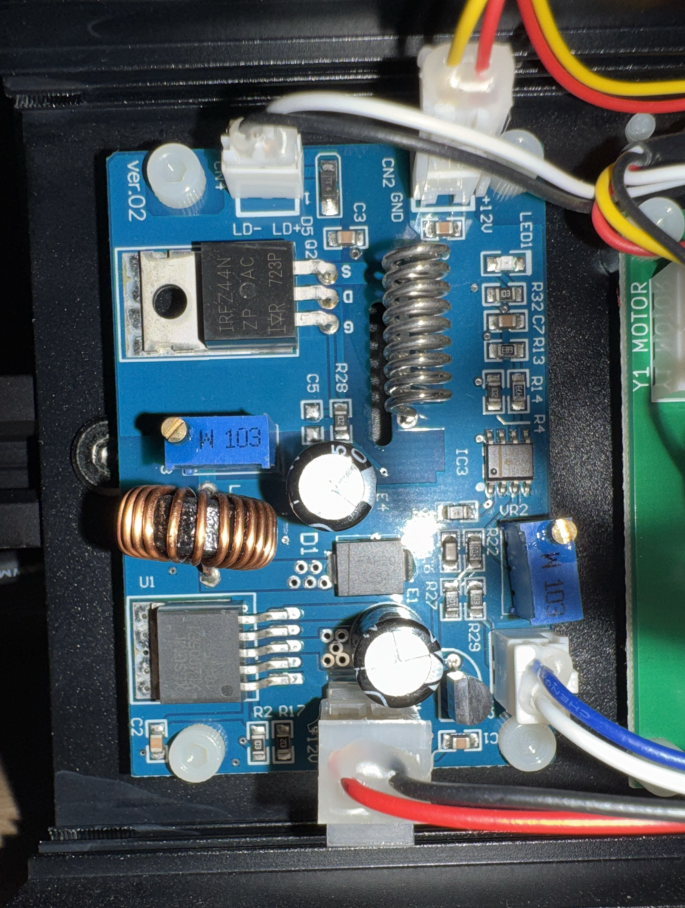
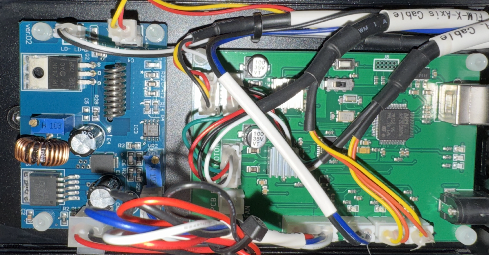

藍板的特寫,還有主控板上的 LASER 接頭:

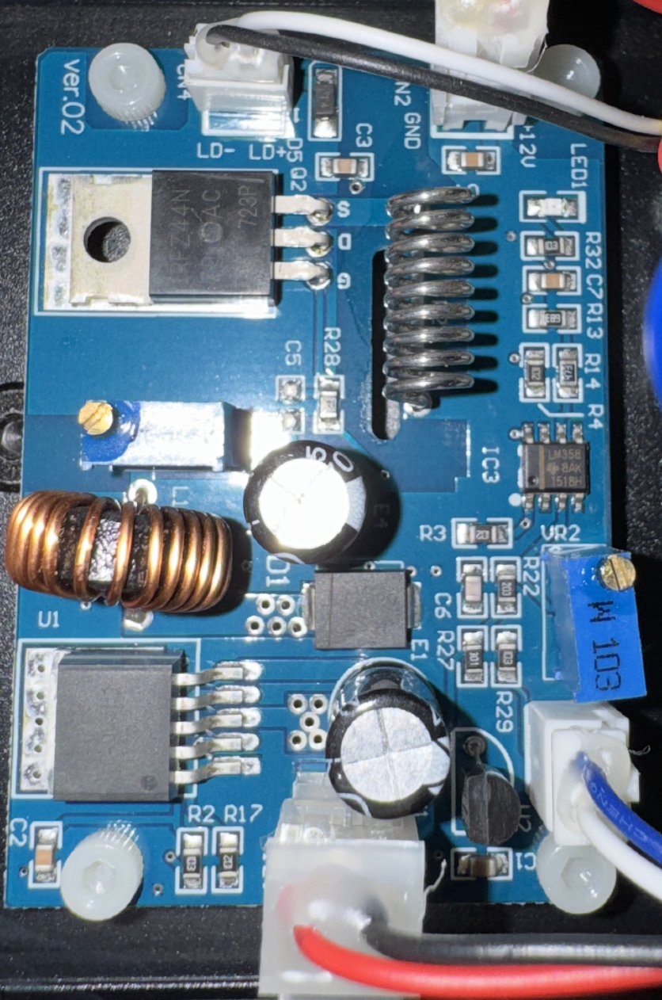
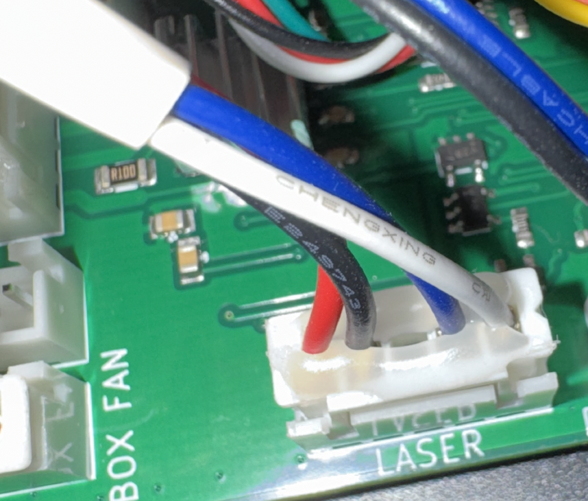

用三用電表量:

| 量測點 | 結果 |
| --- | --- |
| 雷射頭輸出端 LD+/LD− | 照射時 5.8V,停止後慢慢降下來 |
| 白線(對 GND) | 0.2〜0.9V 之間跳動 |
| 藍線(對 GND) | 一直 0V |

一開始想直接拿雷射頭的輸出端當泵的開關訊號,但停止後電壓是慢慢降的(驅動板的電容在放電),不能用。所以開始從電路板中往上游找，才發現綠板和藍板之間的藍白線才是真正的控制訊號。

白線 0.2〜0.9V 這個怪數字,後來想是 PWM,電表只顯示平均值,而且當時雷射出力沒開滿。

**結論:白線是控制訊號。藍板可以整塊跳過,泵直接接主控板的 LASER 接頭。**

---

## 8/27 蠕動泵單體測試

- 泵單體測試通過,且泵自帶止逆

12V 直接給電,水順利送到管子另一端。切電就停,管子裡不會繼續滴。

蠕動泵的軟管是內徑3mm，外徑5mm。拆除連接器的時候，會因為拔除的拉扯，造成輕微的軟管耗損，未來安裝時需要注意。

蠕動泵停轉的時候滾輪會把管子夾住,所以它自己就是止逆閥。本來擔心的虹吸殘滴問題不用處理了。

[▶ 播放影片:IMG_1731](media/20260827_ポンプ単体テスト/IMG_1731.mp4)
[▶ 播放影片:IMG_1733](media/20260827_ポンプ単体テスト/IMG_1733.mp4)
[▶ 播放影片:IMG_1734](media/20260827_ポンプ単体テスト/IMG_1734.mp4)
[▶ 播放影片:IMG_1735](media/20260827_ポンプ単体テスト/IMG_1735.mp4)
[▶ 播放影片:IMG_1736](media/20260827_ポンプ単体テスト/IMG_1736.mp4)

影片裡切電之後泵好像還轉了一下,那是電源裡的電容在放電,不是水還在滴。實際控制的時候 MOS 模組切的是訊號,不切電源,所以不會有這個現象。

---

## 8/28〜29 Arduino 控制泵 → 雷射訊號直接控泵

- 雷射訊號直接驅動泵成功

準備進行現有機器挪用訊號的工作，進到機器連接之前，先進行Arduino Mega + MOSFET 光耦隔離板控制泵的測試。

先用 Arduino Mega + MOSFET 光耦隔離板(GYJ)控泵,序列埠打指令可以開關。板子有光耦隔離,Arduino 和 12V 不用共地。確認可以運作。

接著把綠板 LASER 接頭的白線藍線**直接**接上 MOSFET 板的訊號輸入,跑 gcode——**雷射該輸出的區間,泵真的轉了。** Arduino 都不需要當中間人。

出力 100% 泵轉得穩，不到30%時水量會幾乎不出水。出力低就會抖。所以 PWM 確實有傳到泵,只是佔空比低的時候扭力不夠。

[▶ 播放影片:20260828_レーザー信号でポンプ駆動](media/20260828_ポンプ駆動/20260828_レーザー信号でポンプ駆動.mp4)

---

## 9/7〜9/10 打包帶回日本

- 機材以托運方式帶回日本

本來想從台灣寄 EMS 回日本,但算了一下:海運航空到貨太慢會壓到重組的時間,當一般包裹寄要課消費稅約五千多,走別送品可以免稅但入境當天要辦手續、包裹還不能比人早到。

也在台灣先將一些備品都買好，包含濕度感測器、固態繼電器、以及其他耗材等等。

最後選追加托運,跟人一起 9/10 到。免稅額內、比 EMS 便宜、當天就在手上。

打包:水全部排乾、鋁擠拆開平放、皮帶放鬆、控制板和 Arduino 這些小東西放隨身行李、雷射模組單獨包好。

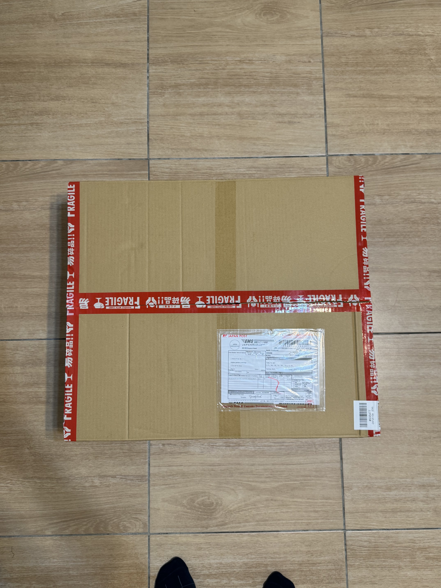
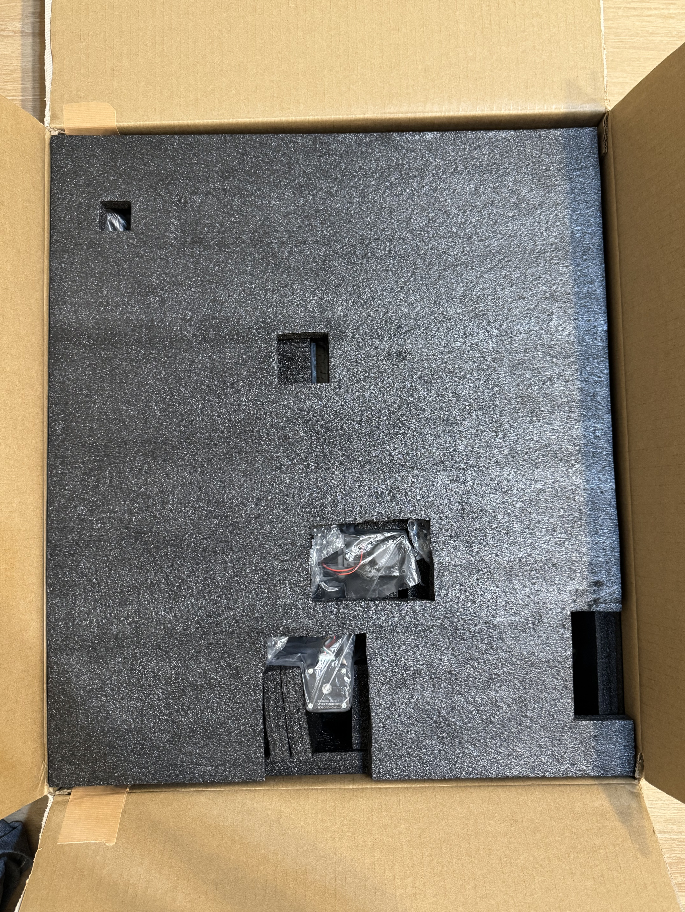
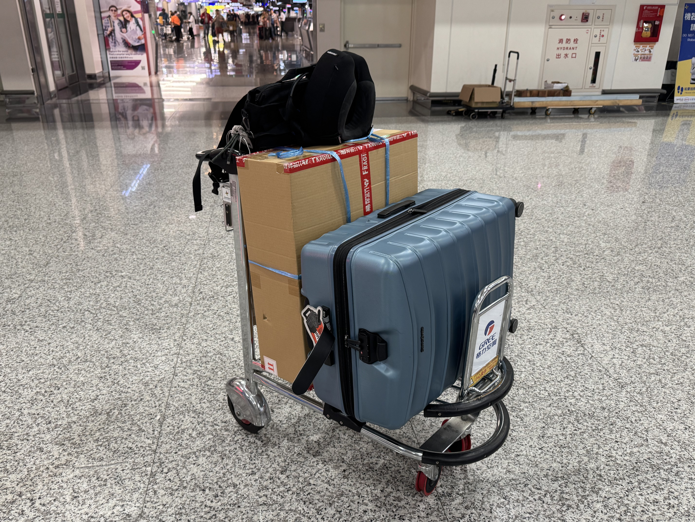

---

## 9/9

- 確定噴嘴是異徑接頭,且幾乎貼著磚面
- 發注管材與接頭

### 研究原作的噴嘴是什麼

看照片研究出水的那個部品。判斷改了三次:

1. 低解析度的照片 → 以為是異徑接頭,上面那段筆直的白管猜是 PTFE 硬管
2. 中解析度的兩張設置照 → 看起來像「溝紋領+圓錐」,改猜是點膠用的魯爾鎖錐形噴嘴,還打算改買針頭套裝
3. 高解析度照片 → **就是異徑接頭。** 之前以為的溝紋領是寶塔接頭的環狀凸緣,圓錐是它細端本身

*(原作的記錄影像截圖。著作權屬作家與攝影者,不收錄於本 repo)*

從照片看到的另外兩件事:

- **噴嘴尖端幾乎貼著磚面。** 水不是滴下去的,比較像接觸轉移過去。這樣位置才準、也不會濺開。所以噴嘴要盡量壓低,但磚面不平,固定機構得能微調高度。
- **水線很寬,而且沿著混凝土的紋理擴散、積在凹處。** 線寬主要不是噴嘴口徑決定的,是水量和磚的吸水性。要調線寬應該先調泵速和描畫速度。

*(原作的記錄影像截圖。著作權屬作家與攝影者,不收錄於本 repo)*

### 發注

依上面的判讀,在モノタロウ下單:

| 品項                | 規格          |
| ----------------- | ----------- |
| シリコンチューブ MGJG-3×5 | 內徑3×外徑5、10m |
| シリコンチューブ MGJG-2×4 | 內徑2×外徑4、1m  |
| シリコンチューブ MGJG-1×2 | 內徑1×外徑2、1m  |
| アラムミニコネクター 170202 | 先端 1.5-3.0  |
| アラムミニコネクター 170301 | 先端 2.2-3.0  |
| コルゲートチューブ CT-3-5  | 5m          |

含稅送料約 3,145 円。

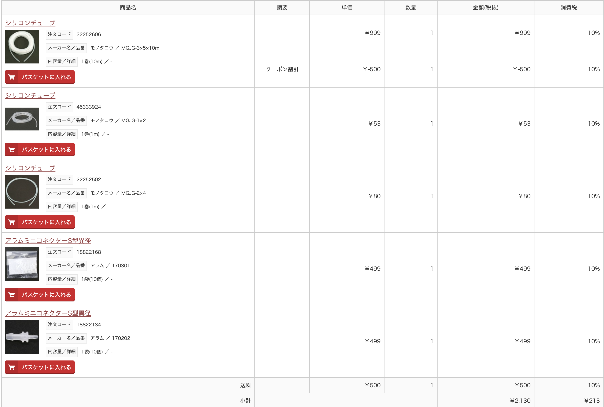
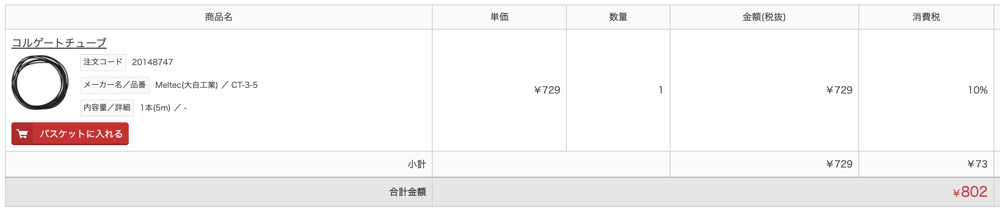

接頭買兩種細端(1.5 和 2.2),一袋 10 個才 499 円,兩種都試。矽膠管備三種內徑,3mm 走主管路,2mm 和 1mm 留著試噴嘴端。

---

## 9/11 復原組裝完成

- 復原組裝完成,通電正常

台灣帶回的東西全部裝回去,通電正常。另外買了混凝土磚 4 塊和木棧板當台座(原作是 3×7=21 塊、放在ランバーコア上)。

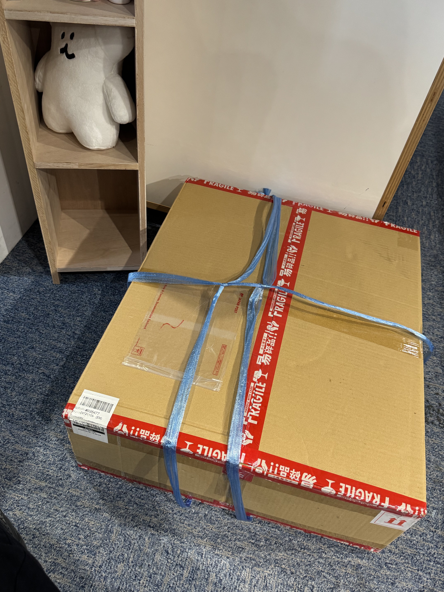
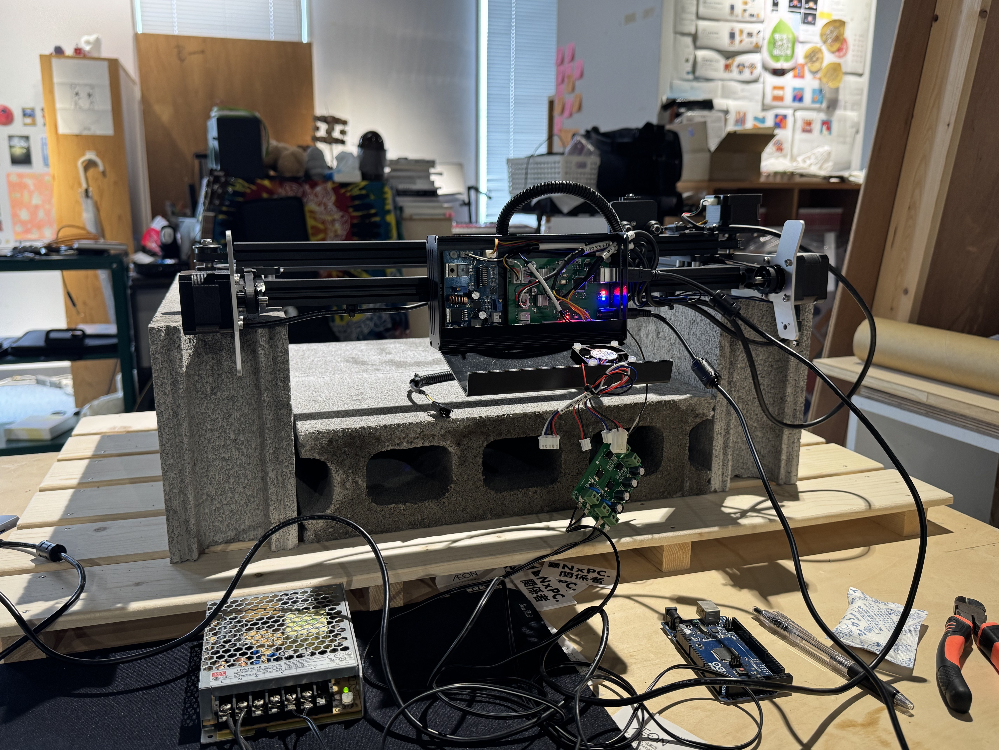
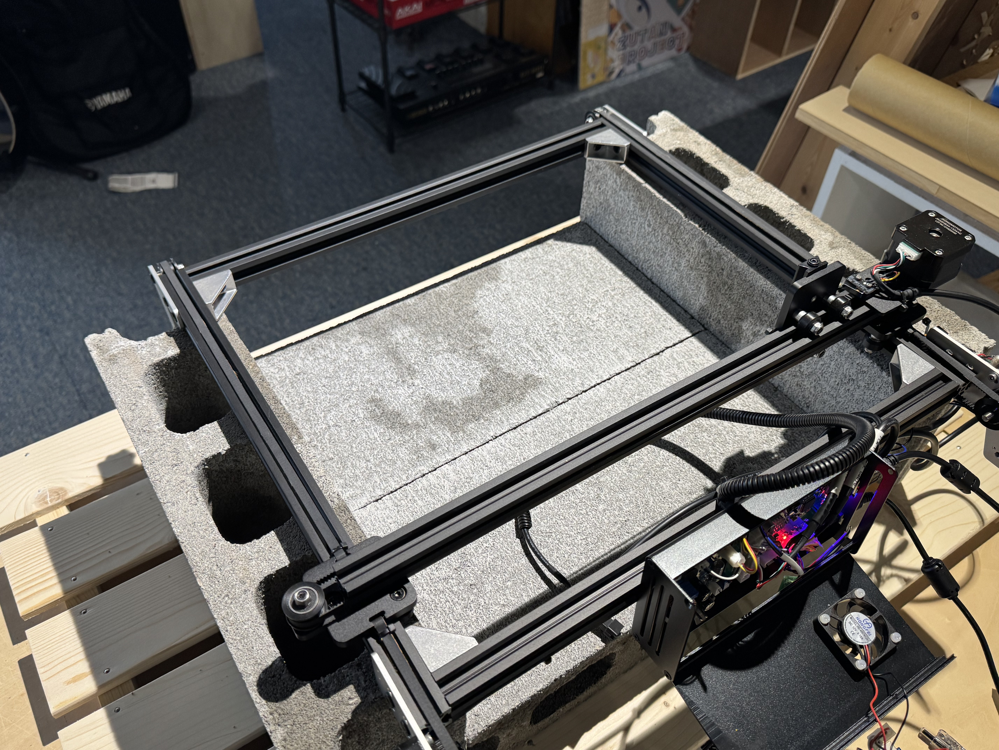

水泥磚看起來濕濕的是因為當天下雨，等管子和接頭到就可以組水路了。

---

## 9/13 初步繪製測試

- 第一次用水畫出來,第一階段達成
- 確認瓶頸是乾燥不是描畫,風扇是關鍵

### 第一次用水畫出來了

管子接頭到貨,水路組好。跑 gcode,**第一次在磚上用水畫出東西。**

出力區間出水、移動區間停水、磚上有可辨識的線——第一階段的目標算是達到了。

[▶ 播放影片:20260913_初回描画](media/20260913_初回描画/20260913_初回描画.mp4)

第一次的參數是速度 6000 / 出力 100%,畫星形:

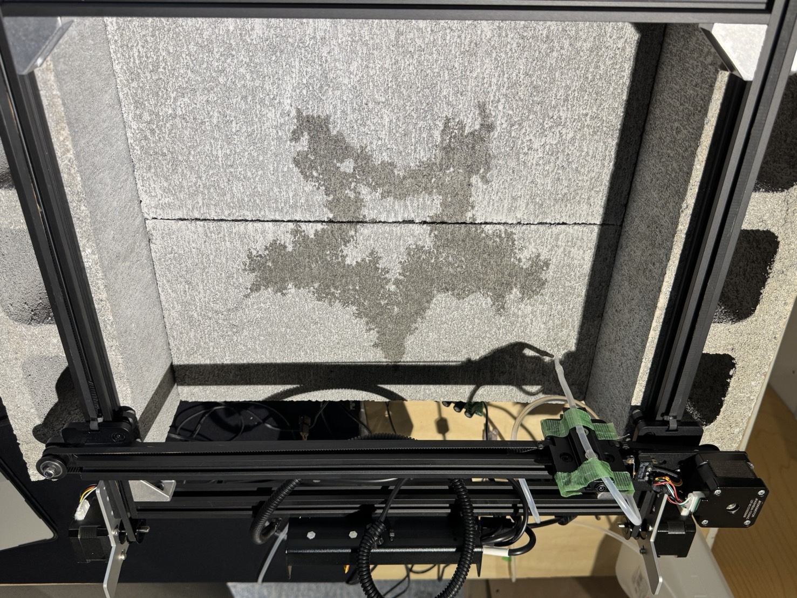

水太多,線都暈開了。而且**冷氣房裡放 30 分鐘還沒完全乾**:

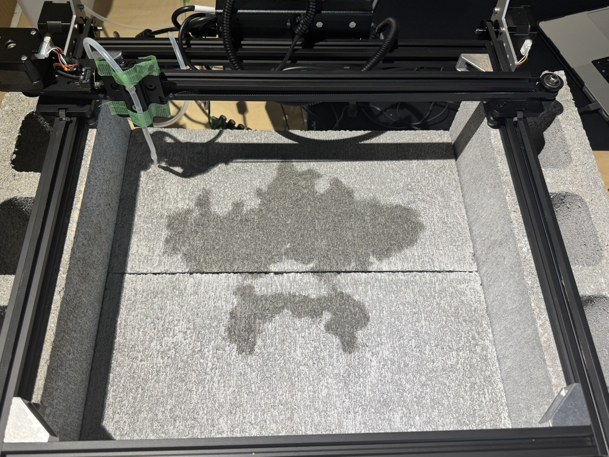

所以畫了同一個圖四次,只改參數。左上 4000/40、右上 4000/30、左下 6000/30、右下 6000/40:

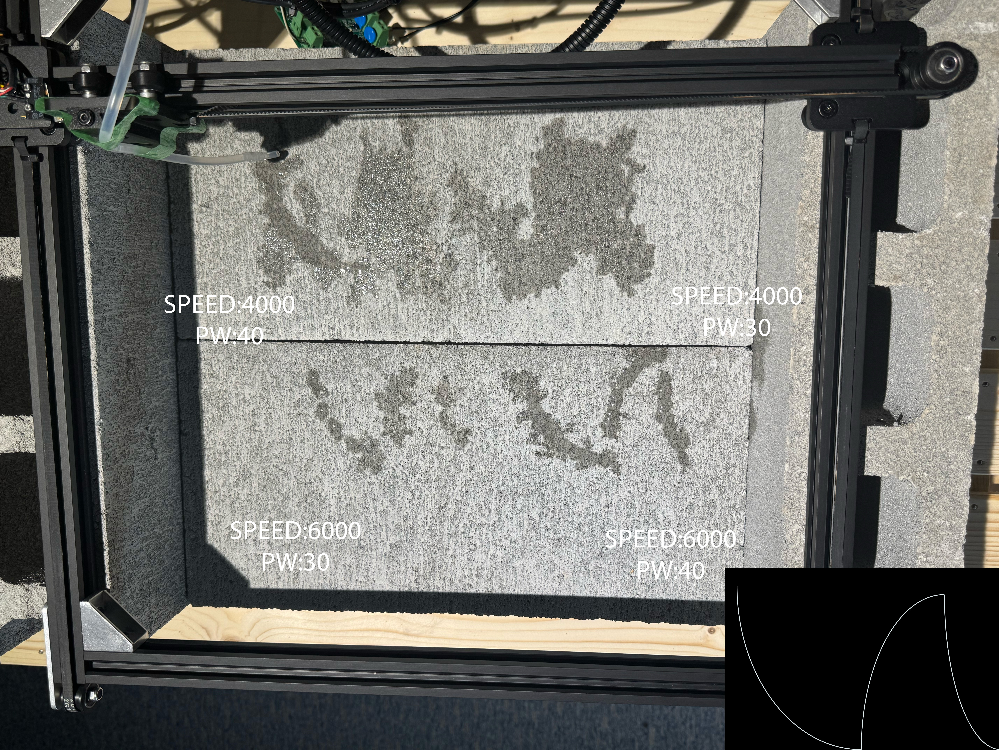

比起出水量,**速度比較關鍵**。出力 30 以下會出現斷點,20 以下幾乎不出水。

### 想一下循環時間的問題

如果目標是10~15分鐘跑完一次循環,現在最大的問題是乾燥,不是描畫。

描畫其實很快。速度 4000 跑 3m 的路徑不到3分鐘。但水要乾掉的時間遠比這個長,所以十分鐘裡幾乎全部都花在等乾。也就是說決定循環長度的是泵送水的速度跟水蒸發的速度的比值。

沒有風扇的話這個數字差太多了(9/13 那次 30 分鐘沒乾就是證據)。**風扇不是周邊零件,是循環能不能成立的關鍵。** 原本排在 Part 5,應該提前進行測試，觀察對於蒸發的效率差異。

另外一個還沒用到的變數是**路徑長度**。總水量 = 路徑長 ×(流量/速度),我一直在調流量和速度,但圖樣越疏水量就越少。目前已經很需要藁科さん那邊的機器學習成果，才能更確實的測試水量與蒸發關係。

接下來也需要測試水量需求。

---

## 9/14 水量與速度參數測試

- 暫定最佳參數 S2000 / P30
- 可用範圍很窄,兩邊都到邊界

固定出力 30,只改速度。

| 速度    | 出力  | 結果               |
| ----- | --- | ---------------- |
| S2000 | P30 | **最理想。線連續,水量剛好** |
| S2500 | P30 | 太快,開始出現點狀        |
| S3000 | P30 | 斷得更明顯            |

描畫中的影片:

S2000 / P30(最理想,線連續)
[▶ 播放影片:20260914_S2000_P30](media/20260914_パラメータ試験/20260914_S2000_P30.mp4)

S2500 / P30(開始出現點狀)
[▶ 播放影片:20260914_S2500_P30](media/20260914_パラメータ試験/20260914_S2500_P30.mp4)

S3000 / P30(斷得明顯)
[▶ 播放影片:20260914_S3000_P30](media/20260914_パラメータ試験/20260914_S3000_P30.mp4)

描畫直後:

S2000 / P30
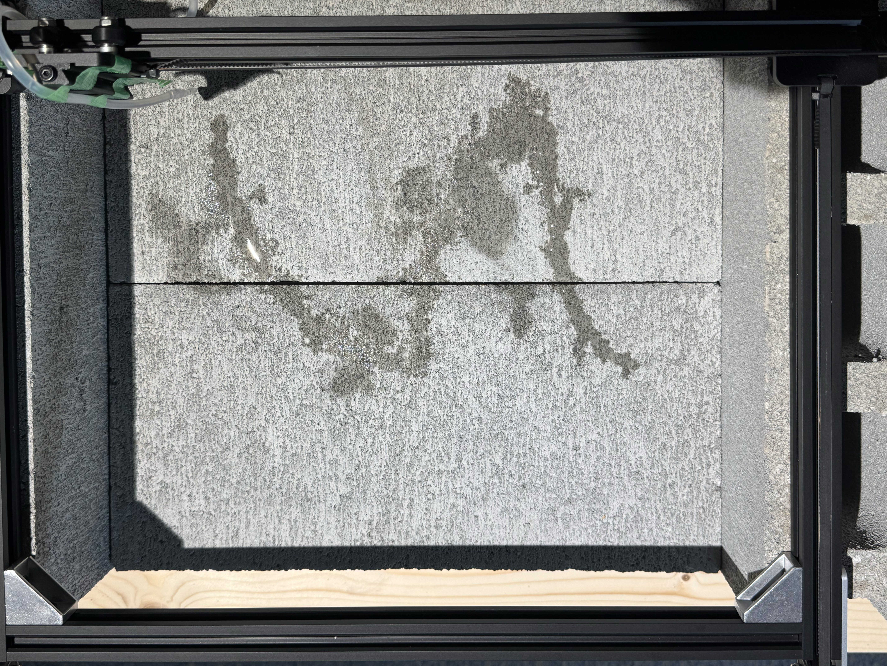

S2500 / P30
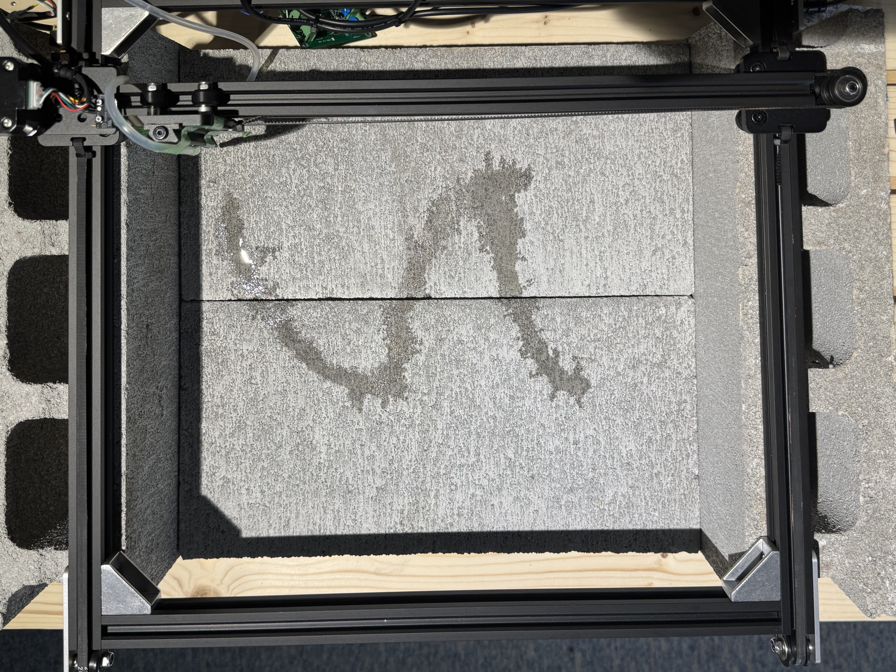

S3000 / P30
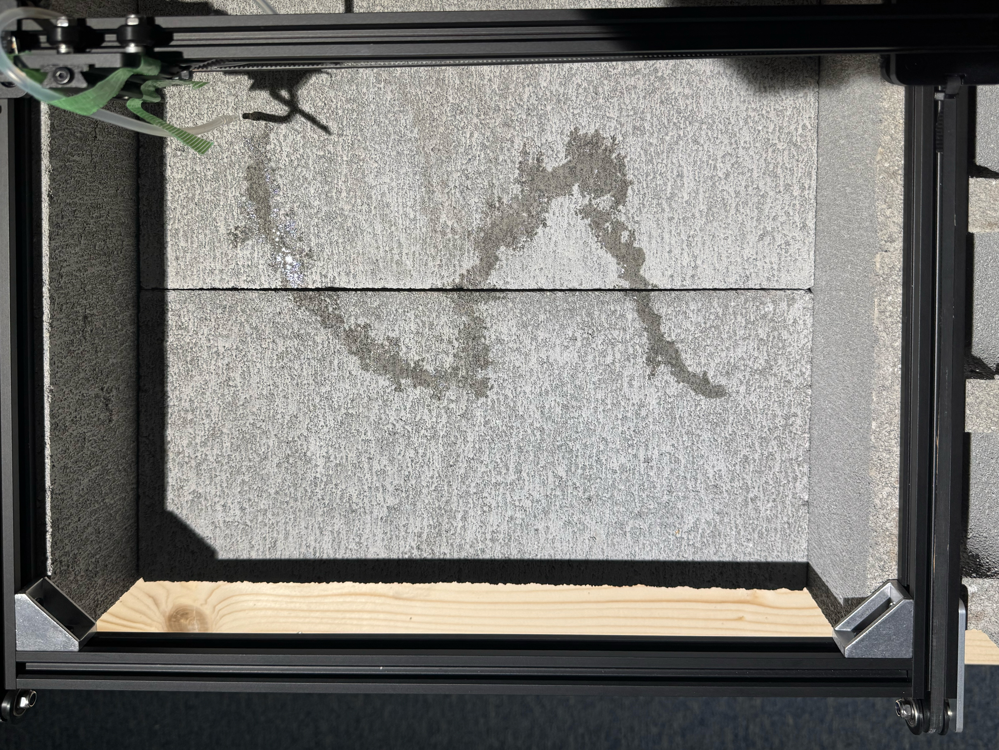

**暫定最佳:S2000 / P30。** 斷續的臨界點在 2000〜2500 之間。出力那邊的下限還是 30。

### 乾燥(冷氣房、沒有風扇直吹、30 分鐘後)

S2500 / P30、30 分鐘後
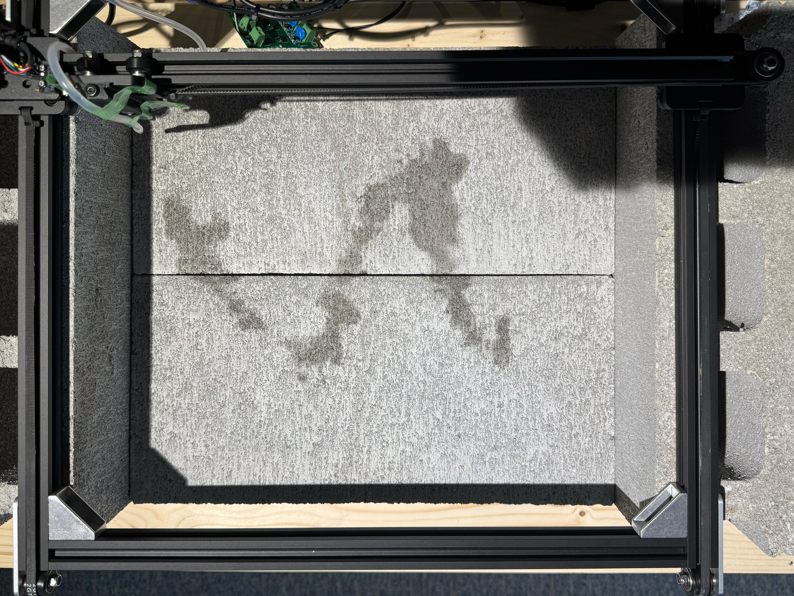

S3000 / P30、30 分鐘後
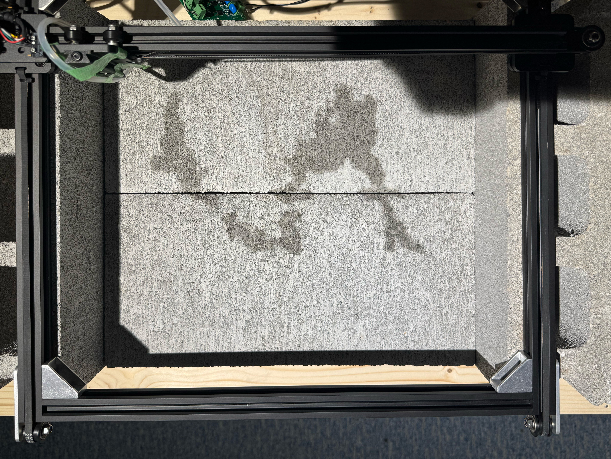

水痕變淡很多但還沒完全消失，不過參照原作展出時的狀態，也並非在完全乾燥的狀態下才允許作畫，目前還不清楚濕度確切數值，不過目測是至少不要有積水的狀況。

［人工知能美学芸術展］ギャラリートーク 07 (III) やんツー 影片截圖
*(原作的記錄影像截圖。著作權屬作家與攝影者,不收錄於本 repo)*

另外這次注意到水痕殘留得**不均勻**,水量多的地方(轉折處、路徑重疊的地方)最後才乾。這樣「乾了沒」的判定會看感測器裝在哪裡？感測器很有可能需要延伸觸媒到不同水泥磚上，讓濕度是一個最終平均值，同時不允許特殊濕度高的存在。

---

## 9/15

- 自動化方針定案:滑鼠操作 + 雷射訊號判定結束
- 看懂噴嘴構成:軟管穿在壓克力硬管裡

### 自動化的設計方向

開始想 Max/MSP 的自動化。要做的有三塊:

1. Max 讀 Arduino 的濕度值,到條件就啟動描畫
2. Max 經 Arduino 控固態繼電器開關電風扇(描畫時關、畫完開)
3. 用滑鼠軌跡紀錄去操作 SmartDIYs Creator:點「アイテムを追加」→ 選檔案 → 點 START
4. Max 讀 Arduino 擷取雷射訊號(白線)，一定時間沒出水後，作為繪製結束的判定。


滑鼠自動化看起來像是繞路,但它符合 yang02 的風格——**技術可視化**。議題A 4-3 整理過他「讓人直接看見配線與 patch 畫面」的傾向,OIST 那次他自述講究的是「注意深く追ってくと何がどうなってんのかわかる配線」。

那麼螢幕上游標自己移動、自己點按鈕,這件事本身就是機制的暴露。觀眾看得到機器在操作另一台機器。這不是隱藏起來的自動化,是演出來的自動化。

→ 所以自動化的方式要照原作走,而且**游標的移動應該被看見**。這會影響工具的選擇(見下)。

#### 游標該怎麼動

一開始想的是錄下自己操作的軌跡再重播(人的手勢被錄一次、由機器永遠重複,概念上很對)。但**再看記錄影片,游標的移動非常直線,不像錄下來的人類軌跡**,而是在兩點之間線性插值的程式動作。

那麼原作大概是在 Max 裡直接控游標。最可能的是 **aka.mouse**。原作也是用這個Object。

**但 aka.mouse 已經停止支援**,現在的 Max / macOS 跑不動。所以改用 **11clicks**。
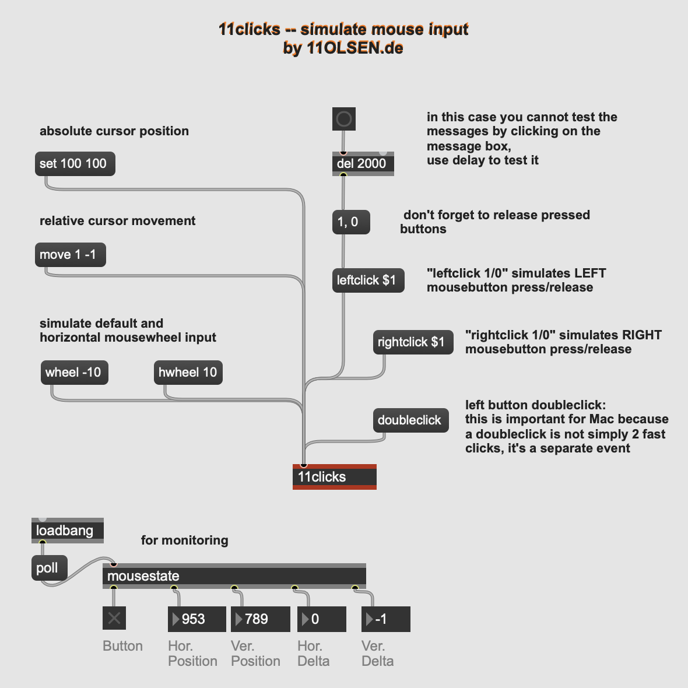
11clicks 預設是瞬移,所以要自己做插值——把路徑切成幾十段,逐段 `m:x,y` + `w:ms`。這樣出來的移動是直線平滑的,跟原作影片看到的一樣。移動時間設 900ms 左右,看起來就像有人在操作。

#### 描畫結束怎麼判定

 **讓 Arduino 也讀雷射訊號(白線)** → 訊號連續靜默 N 秒 = 畫完

選第三個。白線本來就有,只是多接一支腳位。這樣一顆 Arduino 同時做:讀濕度、讀雷射訊號、控風扇。泵還是由雷射訊號直接驅動,不經過 Arduino。

訊號狀態整理:

```
1. 濕度 ≥ 乾燥閾值 + 並非描繪中 → 乾燥待ち(風扇 ON)  
2. 濕度 < 乾燥閾值 + 並非描繪中 → 重播滑鼠軌跡 + 風扇 OFF
3. （描畫中）雷射訊號靜默 N 秒 → 結束
4. 回 1
```

閾值要有遲滯帶，不然讀值在邊界抖動風扇會瘋狂開關。

### 看懂噴嘴那段是怎麼配置的了

終於看懂最終出水那段。**透明的壓克力硬管裡面,看得到軟管稍微蜿蜒的樣子。**

*(原作的記錄影像截圖。著作權屬作家與攝影者,不收錄於本 repo)*
*(原作的記錄影像截圖。著作權屬作家與攝影者,不收錄於本 repo)*

所以構造是:

```
矽膠軟管(推測 內徑3×外徑5)
   ↓ 穿過
透明壓克力硬管(當垂直的固定支撐)
   ↓ 下端露出一小段
矽膠軟管 + 異徑接頭(噴嘴)
```

這解決了 9/9 留下的疑問。之前不確定上面那段是軟管還是硬管,答案是**兩者都是**:軟管在裡面所以看起來半透明,壓克力在外面所以筆直。

#### 要買的

壓克力硬管,內徑 6 / 外徑 8。矽膠管外徑 5 穿進內徑 6 有 1mm 餘隙,穿得過去也還留得下蜿蜒的空間。
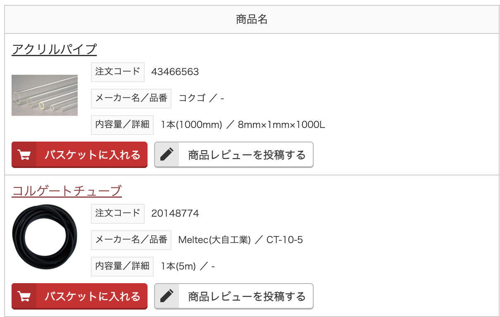

---

## 9/16

- 找到當時的控制軟體(瀏覽器版),並確認它能驅動 FABOOL
- 寫了 Arduino 韌體與 Max patch,濕度讀取與風扇控制實機測試通過
- 發現兩次展出的磚厚度不同

### 找到當時的控制軟體了

找到「Smart Laser CO2」的軟體說明(`ソフトウェアの使い方.md`)。這就是那個有 localhost 的網頁版控制方式。
#### 檔案格式確認

記錄影片的畫面截圖裡,載入的檔名就是 **`gcode.ngc`**:

*(原作的記錄影像截圖。著作權屬作家與攝影者,不收錄於本 repo)*

預覽圖裡的斜線是**移動ライン**(空走路徑),手冊也提到會一起顯示。

#### 關鍵:每次都覆寫同一個檔案

因為選取檔案的地方只有一個檔案，所以推測原作是**每次描畫前重新讀取被覆寫的同一個 `gcode.ngc`**。

這解釋了固定座標的滑鼠自動化為什麼能穩定運作:**檔名和路徑永遠不變,對話框每次打開時檔案都在同一個位置。** 

→ 跟藁科さん的介面定為:**固定路徑、固定檔名、每次覆寫**。

#### 驗證結果:舊軟體確實能驅動 FABOOL
macOS 12.3 之後系統已經移除 Python 2，所以需要重新安裝 python2。

在 py27 環境下跑起來了:

```
#  FaboolLaserMini 3.00
```

安裝流程紀錄
版本確認:

```
uname -m                     # arm64 = Apple Silicon,x86_64 = Intel
cat /path/to/run.command     # 看它到底呼叫什麼(說不定自帶 python)
```

```
# 先裝 Rosetta(如果還沒裝)
softwareupdate --install-rosetta

# 裝 miniforge
brew install miniforge
conda init zsh          # 之後重開終端機

# 建一個 x86_64 的 Python 2.7 環境
CONDA_SUBDIR=osx-64 conda create -n py27 python=2.7
conda activate py27
conda config --env --set subdir osx-64    # 鎖住,之後裝套件才不會抓錯架構

python --version        # 應該顯示 Python 2.7.x
```

```
curl https://bootstrap.pypa.io/pip/2.7/get-pip.py -o get-pip.py
python get-pip.py
pip install pyserial
```
裝完之後跑，這也是每次要執行程式的步驟。
```
conda activate py27 
cd /Users/tim/Downloads/SmartLaserCo2MacJa 
ls -la 
./run.command
```

如果權限出問題：移除隔離屬性 + 重新用 ad-hoc 簽章。

```
cd /Users/tim/Downloads/SmartLaserCo2MacJa
xattr -dr com.apple.quarantine .
codesign --force --sign - backend/PIL/.dylibs/*.dylib
codesign --force --sign - backend/PIL/*.so
./run.command
```


### 寫了 Arduino 和 Max/MSP 的程式

#### Arduino:`arduino/GraffitiIO/GraffitiIO.ino`

負責感測與風扇,不管泵(泵由雷射訊號經 MOSFET 板直接驅動)。

做三件事:讀水分感測器、監看雷射訊號算出靜默時間、依指令開關 SSR 控制風扇。每 100ms 送一行 `st <hum> <laser> <silent> <fan>` 給 Max,接收的指令只有 `f1` / `f0`。

接線:A0 水分感測器 / D4 感測器 VCC(只在讀取時通電) / D2 雷射訊號(白線) / D8 SSR。

閾值判斷和狀態機不放在這裡,留給 Max,這樣調閾值不用重燒板子。

#### Max/MSP:`max/GraffitiControl.maxpat`

總指揮。分成六塊:

- **⓪ 狀態欄** 模式、狀態、濕度、出水、靜默秒數、風扇、受信
- **① 通信** 收 Arduino 的序列埠資料並拆成四個值
- **② 判定** 乾燥閾值與靜默閾值,都可即時改
- **③ 狀態遷移** 等乾 ⇄ 描畫中。含 GUARD(描畫剛開始不理靜默判定)與自動/手動模式開關
- **④ 風扇** 送 `f1` / `f0` 給 Arduino
- **⑤ 滑鼠操作** 六步的表:移動 → 左鍵點擊 → 等待,操作瀏覽器版的控制軟體
- **⑥ 手動操作** 繞過自動判斷的按鈕

刻意用純 Max 物件寫,沒有包進 `[js]`——這個 patch 會顯示給觀眾看,黑箱化會抵銷技術可視化那層。

#### Arduino ↔ Max 的實機測試

- Max 讀 Arduino 的濕度值:**成功**
- Max 經 Arduino 控制固態繼電器:**成功**
- 讀雷射訊號:**還沒測**。Type-A 的接口不夠用了(繪圖機、Arduino 都要佔一個),明天帶排數多一點的 Type-C to A 轉接器再接。

所以目前循環裡只剩「描畫結束的判定」沒驗過,其他三塊都通了。預計 9/17 完成全自動化。

#### 還要做的

- 量六個座標填進表裡
- **確認濕度的方向**。我用的是原作推測的慣例:值越大=越乾(乾燥 ≥235、濕潤 ≤150)。如果實測是反的,`[expr $i1 >= $i2]` 要改成 `<=`。
- GUARD 的 25 秒是估的,要實測整段跑完的時間再調
- 啟動時的原点復帰目前不在自動流程裡

### 兩次展出的水泥磚尺寸不一樣

從影像確認,兩次展出用的磚不同:
「大いなる日常」@ NO-MA(滋賀)
*(原作的記錄影像截圖。著作權屬作家與攝影者,不收錄於本 repo)*

「人工知能美学芸術展」@ OIST(沖縄)
*(原作的記錄影像截圖。著作權屬作家與攝影者,不收錄於本 repo)*

| 展出                    | 期間                   | 磚的尺寸               |
| --------------------- | -------------------- | ------------------ |
| 「大いなる日常」@ NO-MA(滋賀)   | 2017年2月18日～ 3月20日    | 390×190×**100**(薄) |
| 「人工知能美学芸術展」@ OIST(沖縄) | 2017年11月3日〜2018年1月8日 | 390×190×**150**(厚) |

目前 prototype 用的是第一次展出的薄型(390×190×100)。

#### 為什麼第二次換厚的?(假說)

水在磚上不只是蒸發,也會往磚裡吸。厚的磚吸水容量大,所以連續運轉時要更久才會飽和。

如果這個假說對,那對我來說是個重要的提醒:**乾燥時間可能會隨著運轉時數變長。** 我目前測的都是乾磚的第一次或第二次,單次的數據。要驗證的話,連續跑幾小時看乾燥時間有沒有變長就知道。

#### 要決定的

正式版用哪一種。現在傾向厚型(對應長時間運轉),但要先確認會場的承重和搬入條件。如果只能用薄型,那就把「連續運轉時乾燥時間變長」當成已知的限制來設計循環。

---

## 9/17

- **Prototype 正式完成**:Max/MSP 全自動控制跑通,連續循環 2小時、描畫 11 次
- 噴嘴加上透明壓克力硬管,出水位置穩定下來

### 自動化完成

Max/MSP 這邊四塊全部跑通:計時、濕度感測、繼電器風扇控制、滑鼠操控。**連續跑了2小時,循環 11 次沒有中斷。**

[▶ 播放影片:20260917_自動フロー記録](media/20260917_プロトタイプ完成/20260917_自動フロー記録.mp4)

控制台除了自動循環,也有手動描畫、手動原點復歸、手動風扇開關,測試和展場排除狀況都用得上。

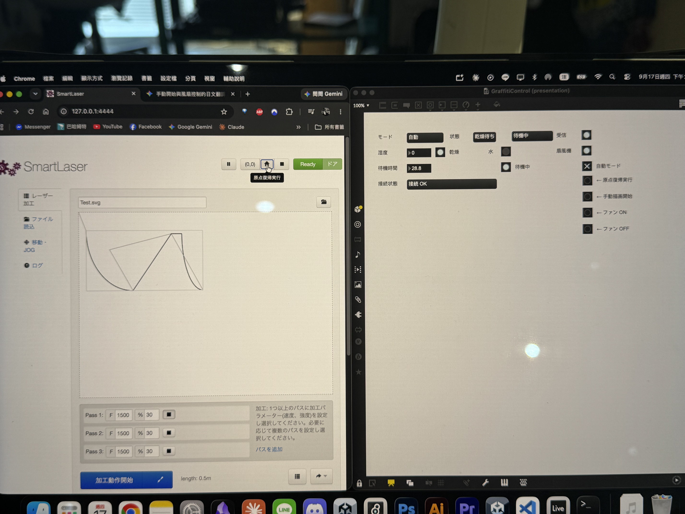

所有條件都是 number box,之後換成正式尺寸再重新調參數就好(濕度 gate、待機時間、移動座標、各段等待)。

### 噴嘴:加上壓克力硬管

依 9/15 對原作的判讀,把矽膠軟管穿進透明壓克力硬管裡。出水位置明顯穩定了,不會再因為滑車加減速而晃。

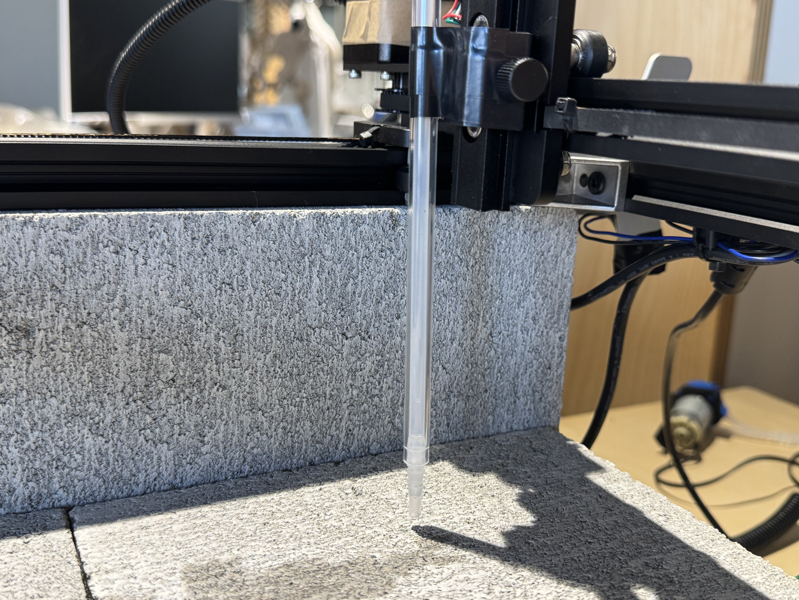
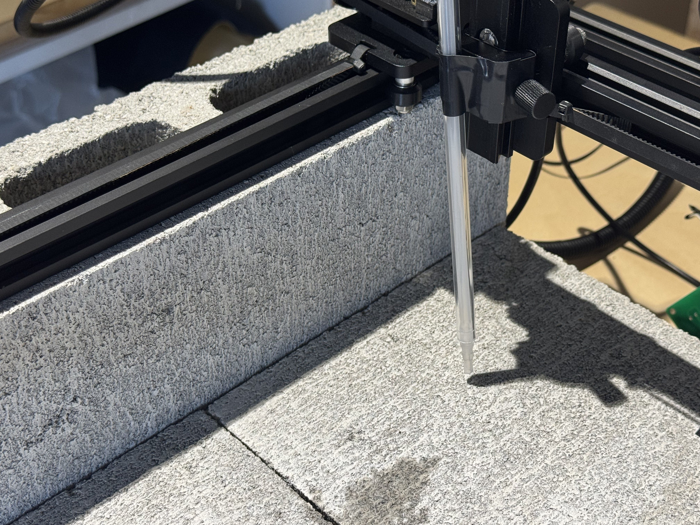

還不夠的是**硬管跟滑車之間的固定**——目前靠現成的夾持方式,外力一碰還是會跑位。下一步做 3D 列印的底座。

### 目前的樣子

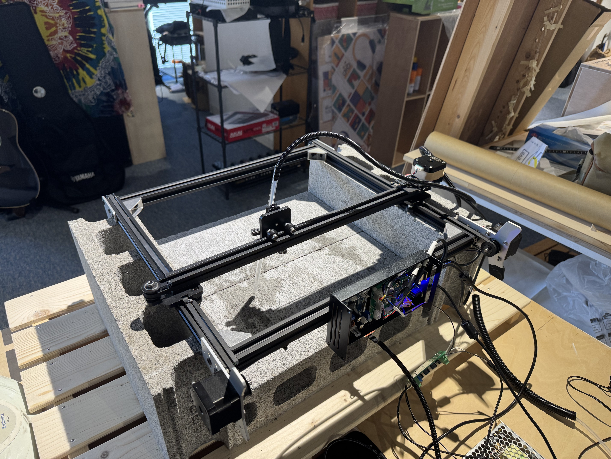
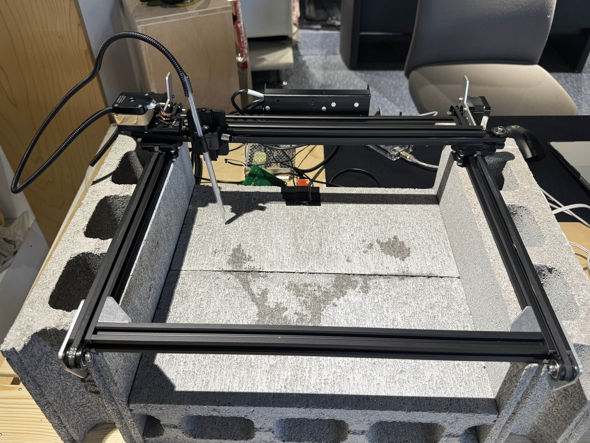
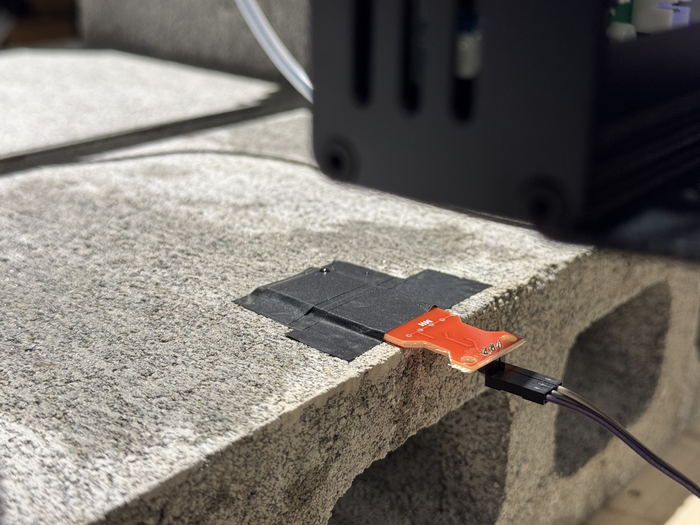

### 接下來

1. 3D 列印硬管的底座
2. 找適合夾住濕度感測器的夾具(原作是用夾具固定的)
3. 讓 Max 的顯示畫面接近原作
4. 加上頂部拍攝的 WebCam
5. 進入正式製作,延長鋁擠型
6. 找最接近原作的電風扇與水桶

---

## 待辦

- [x] 壓克力硬管購入與安裝
- [ ] 3D 列印硬管的底座(目前固定不夠牢)
- [ ] 找夾住濕度感測器的夾具
- [ ] Max 顯示畫面接近原作
- [ ] 加頂部 WebCam
- [ ] 找接近原作的電風扇與水桶
- [ ] 泵流量曲線(量杯,各出力一分鐘)
- [ ] 風扇裝上,量蒸發速率
- [ ] 連續運轉幾小時,看乾燥時間會不會隨含水累積而變長
- [ ] 正式版的磚選薄型(100)還是厚型(150)——先確認會場承重
- [x] Part 4 水分感測
- [x] Part 5 風扇(SSR 控制)
- [x] Part 6 Max/MSP 狀態機
- [x] Arduino 韌體(讀雷射訊號、SSR 控風扇)
- [x] 11clicks 放進 Max 搜尋路徑、輔助使用權限
- [x] 量六個座標填進 Max 的表裡
- [x] 確認濕度讀值的方向(Water Sensor:有水=大)
- [ ] GUARD 時間實測後調整
- [ ] 原点復帰要不要納入自動流程
- [ ] 瀏覽器視窗大小與縮放比例固定(座標才不會跑掉)
- [x] 舊版瀏覽器軟體能驅動 FABOOL(banner: FaboolLaserMini 3.00)
- [ ] 在瀏覽器版走一次完整流程:原点復帰 → 讀 gcode.ngc → 加工開始
- [ ] 決定正式版用哪套軟體(舊瀏覽器版 / 新 SmartDIYs Creator)
- [ ] 量瀏覽器版的六個座標,填進 Max 的表
- [ ] 跟藁科さん確認:固定路徑+固定檔名(gcode.ngc)、每次覆寫;重描由我這邊在軟體裡設

## 要補的資訊

- 8 月那些沒記日期的項目(FABOOL 購入、組裝、回路解析)的實際日期
- FABOOL 是在哪買的、怎麼拿到的(之後寫採購和精算會用到)
- 各階段的作業地點
- 原作參考照片的出處(Vimeo 記錄映像 / 展示記錄照片的區別)
